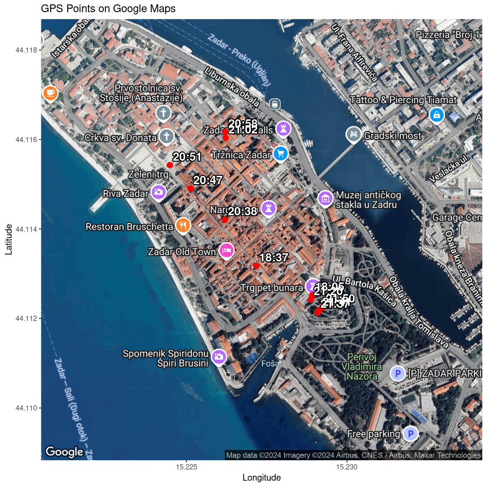

# R-gpx-plotter: A simple tool to add points to a static Google map

## Preamble

The scripts were originally designed to help mapping [my iNaturalist observations](https://www.inaturalist.org/people/alexei_kouprianov). My DSLR camera lacks a buil-in GPS module and the external GPS module I used was broken (and failed all too often when it was still alive). I record points with GPX-tracker app on my iPhone, then send the resulting GPX file to my e-mail and use it with the these scripts to produce a map of observations, which can be used to manually set the point coordinates when uploading observations to iNaturalist platform.

It is recommended to run the scripts from the `scripts` folder, keep your Google Maps API key in `misc/google_maps_API_key.txt` (NB! do not forget to replace the contents of the currently present file, which contains only a reminder), your GPX files in the `data` folder, and read the maps from `plots` folder. The repository is provided with two real-life examples of GPX files (Göttingen and Zadar) and three plots (set in different map types) resulting from the Zadar excursion.

## Usage

    Rscript GPX.main.r ../data/filename.gpx size maptype

- `size` (mandatory) : one- or two-digit integer, the greater the value, the bigger is the magnification; recommended value for a small excursion is 15; watch the textual output to the console: if the script reports dropping some data points, then the size (magnification) is too big, consider diminishing size or splitting the GPX data file into smaller parts.

- `maptype` (optional): supported map types : `satellite`, `roadmap`, `hybrid` (defaults to `hybrid` when no map type is provided).

## Example command line

    Rscript GPX.main.r ../data/2024-10-12.Zadar.gpx 16 hybrid

## Example map

